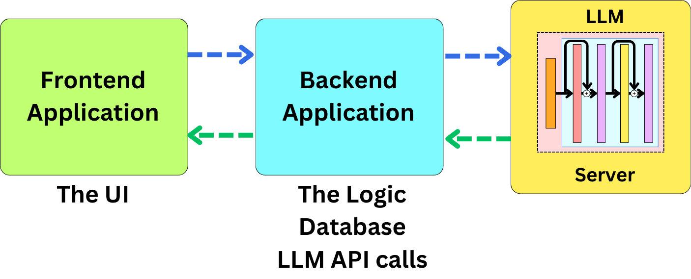
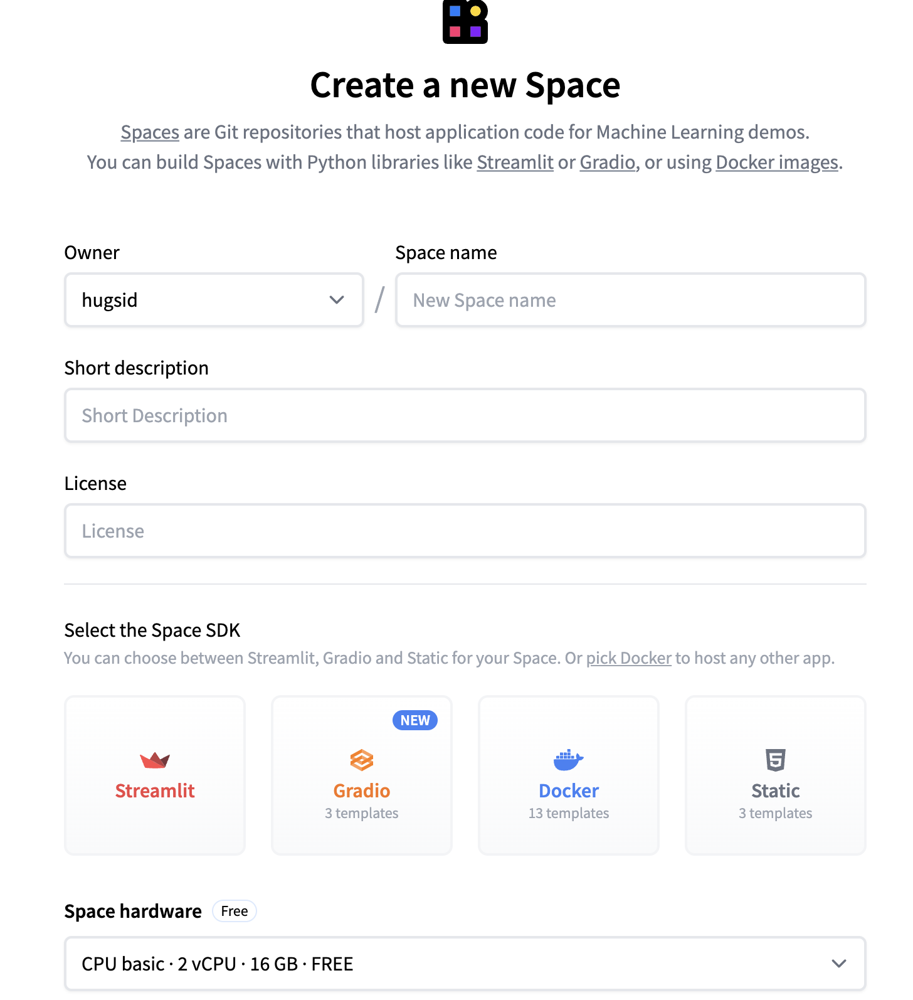
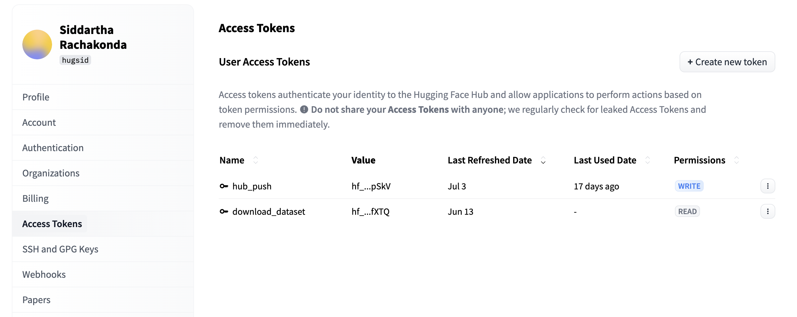
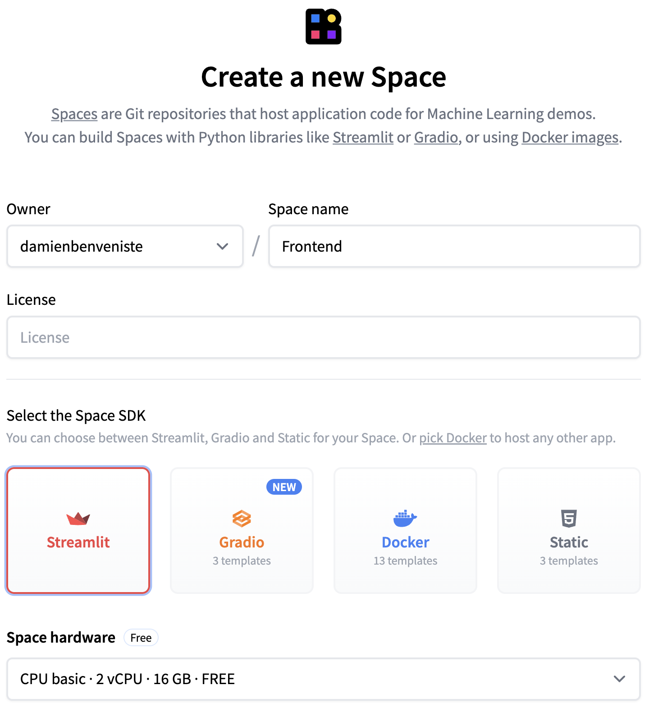
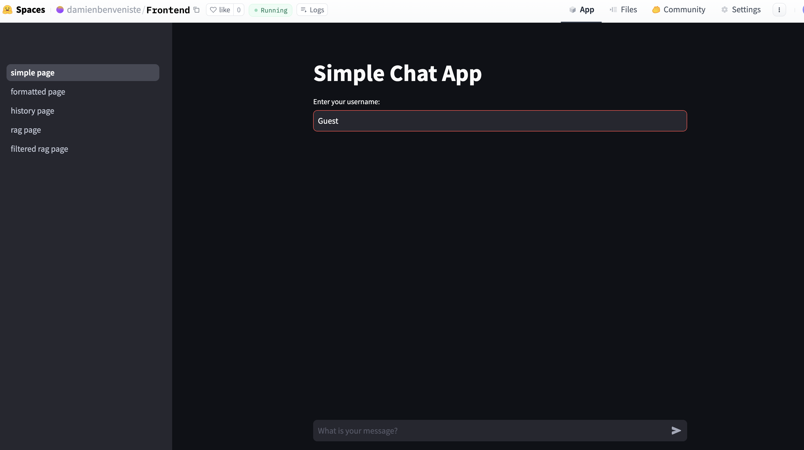

# Deploying an LLM Application

## Introduction

The purpose of this guide is to walk you through the process of building and deploying a Large Language Model (LLM) application. The project architecture consists of a backend, frontend, and an LLM server for seamless interaction between these components. We assume familiarity with Python, FastAPI, and basic machine learning concepts. The backend leverages FastAPI, while the frontend uses Streamlit, and they are deployed on HuggingFace Spaces.

## Architecture Overview

The application architecture is made up of three primary components: the frontend, backend, and an LLM server. Here's a high-level visual representation of the architecture:



- **Frontend**: Developed with Streamlit for fast and straightforward UI.
- **Backend**: Developed with FastAPI for performant and efficient API creation.
- **LLM Server**: Powered by an LLM (e.g., meta-llama/Meta-Llama-3-8B-Instruct), deployed to a HuggingFace serverless endpoint.

## Deployment of the Backend

### Setting up HuggingFace Space for the Backend

1. **Create a Space**: Generate a blank Docker application named "Backend" within the HuggingFace Spaces platform. This will be the foundation for deploying the backend application.



2. **Clone Repo and Setup Project**:
    ```bash
    git clone https://huggingface.co/spaces/damienbenveniste/backend
    ```
   - Create a `requirements.txt` with the following dependencies:
     ```plaintext
     fastapi
     uvicorn[standard]
     langchain
     sqlalchemy
     pinecone-client
     ```
   - Create the main FastAPI application in `app.py`:
     ```python
     from fastapi import FastAPI
     app = FastAPI()

     @app.get("/")
     def greet_json():
         return {"Hello": "World!"}
     ```

3. **Create Dockerfile**: Set up your `Dockerfile` to install dependencies and run the app.
    ```dockerfile
    FROM python:3.12
    # Subsequent Docker instructions
    ```

4. **Deploy the Application**: Add the application files to the repo and push to deploy.
    ```bash
    git add requirements.txt app.py Dockerfile
    git commit -m "Add application file"
    git push
    ```

5. **Query Deployed Endpoint**: Verify the deployment by querying the endpoint.
    ```python
    import requests

    url = "https://damienbenveniste-backend.hf.space"
    response = requests.get(url)
    print(response.json()['Hello'])  # Expected output: 'World!'
    ```

### Building Advanced Backend Features

1. **Streaming Endpoint**: Establish simple streaming with an HLLM connection.
   - Implement a streaming endpoint using FastAPI's `StreamingResponse` to handle large data efficiently.
   - Example:
     ```python
     from fastapi.responses import StreamingResponse

     @app.get("/stream")
     async def stream_data():
         async def data_generator():
             for i in range(10):
                 yield f"data: {i}\n\n"
                 await asyncio.sleep(1)
         return StreamingResponse(data_generator(), media_type="text/event-stream")
     ```

2. **Formatted Streaming and History Tracking**: Extend the backend by formatting prompts and maintaining conversation history.
   - Use Langchain's `PromptTemplate` for prompt formatting.
   - Example:
     ```python
     from langchain import PromptTemplate

     def format_prompt(user_input):
         template = PromptTemplate("User: {input}\nAI:")
         return template.format(input=user_input)
     ```

3. **Retrieval Augmented Generation (RAG)**: Implement interaction with a vector database for data retrieval, then integrate RAG.
   - Use Pinecone for vector search.
   - Example:
     ```python
     import pinecone

     pinecone.init(api_key="YOUR_API_KEY")
     index = pinecone.Index("example-index")

     def retrieve_data(query_vector):
         return index.query(query_vector, top_k=5)
     ```

4. **Hybrid RAG**: Leverage metadata and search filtration to refine data retrieval, improving response specificity.
   - Implement metadata filtering in the retrieval process.
   - Example:
     ```python
     def hybrid_retrieve(query_vector, metadata_filter):
         return index.query(query_vector, top_k=5, filter=metadata_filter)
     ```

### Implementing Key Backend Components

For each section (as elaborated upon in the problem description):

- **Prompt Formatting**: Implement `format_prompt` and extend chain functionalities by leveraging Langchain's `PromptTemplate` and `RunnableChain`.
- **Chat History Management**: Utilize database operations with SQLAlchemy to manage users and their message histories (`get_user_chat_history`, `add_message`).
  - Example:
    ```python
    from sqlalchemy import create_engine, Column, Integer, String, Text
    from sqlalchemy.ext.declarative import declarative_base
    from sqlalchemy.orm import sessionmaker

    Base = declarative_base()

    class Message(Base):
        __tablename__ = 'messages'
        id = Column(Integer, primary_key=True)
        user_id = Column(Integer)
        content = Column(Text)

    engine = create_engine('sqlite:///chat.db')
    Base.metadata.create_all(engine)
    Session = sessionmaker(bind=engine)

    def add_message(user_id, content):
        session = Session()
        message = Message(user_id=user_id, content=content)
        session.add(message)
        session.commit()
    ```

- **Hybrid Retrieval**: Implement vector search mechanisms utilizing Pinecone and provide a refined result set for RAG implementations.

### Secure Application Configuration

- Utilize secret variables for tokens and keys (HuggingFace Token, Pinecone API Key, etc.)



Add Linux command in Dockerfile to use secret variables:
```dockerfile
RUN --mount=type=secret,id=HF_TOKEN,mode=0444,required=true
```

## Frontend Deployment Using Streamlit

1. **Setup Frontend on HF Spaces**: Create a Streamlit application under HuggingFace Spaces for UI interaction.



2. **Clone and Setup**: Clone the repository and set up a basic UI with `streamlit`:
   ```bash
   git clone https://huggingface.co/spaces/damienbenveniste/Frontend
   # Edit app.py to add your frontend logic
   ```

3. **Modify and Enhance**: Employ Streamlit’s components to develop a user-friendly chat interface. Populate with various backend endpoints for comprehensive functionality testing.



## Final Thoughts

You've reached the culmination of deploying a functional LLM application, implementing streaming, conversation memory, and augmented data generation within a basic yet powerful UI framework. You're equipped to refine, expand, and repurpose your understanding into larger, more complex systems. Congratulations on your LLM deployment journey!
